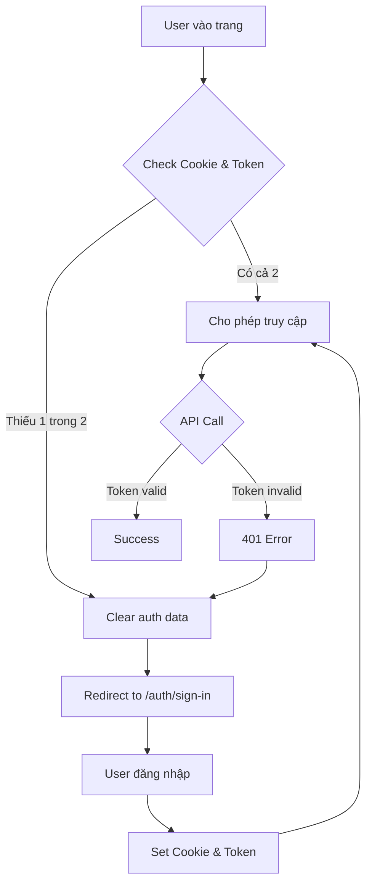

# 🔐 Authentication Fix Guide

## Vấn đề đã sửa

### Nguyên nhân chính
Lỗi `No authentication token found. Please login again.` xảy ra do **mất đồng bộ giữa cookie và localStorage**:
- `isAuthenticated` check cookie `_REBACK_AUTH_KEY_`
- `getAuthToken()` check localStorage `eims_access_token`
- `customerService` dùng sai key `'token'` thay vì `'eims_access_token'`

### Các file đã fix

#### 1. **AuthContext** ([useAuthContext.tsx](src/context/useAuthContext.tsx))
✅ Thêm function `checkAuthentication()` để check cả cookie VÀ localStorage:
```typescript
const checkAuthentication = (): boolean => {
  return hasCookie(authSessionKey) && !!localStorage.getItem('eims_access_token')
}
```

✅ Update Provider để dùng check mới:
```typescript
isAuthenticated: checkAuthentication()
```

#### 2. **InvoiceManagement** ([InvoiceManagement.tsx](src/page/InvoiceManagement.tsx))
✅ Thêm import `useAuthContext`
✅ Check authentication trước khi load data:
```typescript
if (!authContext?.isAuthenticated) {
  setError('Vui lòng đăng nhập để xem danh sách hóa đơn')
  navigate('/auth/sign-in')
  return
}
```

#### 3. **invoiceService** ([invoiceService.ts](src/services/invoiceService.ts))
✅ Cải thiện `getAuthHeaders()`:
```typescript
const getAuthHeaders = () => {
  const token = getAuthToken();
  if (!token) {
    // Clear stale data
    localStorage.removeItem(API_CONFIG.TOKEN_KEY);
    localStorage.removeItem(API_CONFIG.REFRESH_TOKEN_KEY);
    throw new Error('No authentication token found. Please login again.');
  }
  return {
    'Authorization': `Bearer ${token}`,
    'Content-Type': 'application/json',
  };
};
```

#### 4. **customerService** ([customerService.ts](src/services/customerService.ts))
✅ Fix token key từ `'token'` → `API_CONFIG.TOKEN_KEY`
✅ Thêm proper error handling cho 401
✅ Thêm import `API_CONFIG`

#### 5. **templateService** ([templateService.ts](src/services/templateService.ts))
✅ Thêm clear stale data khi không có token

## Cách test

### Test 1: Kiểm tra Auth Status
Mở file [check-auth.html](check-auth.html) trong browser để xem trạng thái authentication hiện tại.

### Test 2: Debug trong Console
```javascript
// Check token
console.log('Access Token:', localStorage.getItem('eims_access_token'))
console.log('Refresh Token:', localStorage.getItem('eims_refresh_token'))

// Check cookie
document.cookie.split(';').find(c => c.includes('_REBACK_AUTH_KEY_'))
```

### Test 3: Kiểm tra flow đăng nhập
1. Mở DevTools → Application → Clear all storage
2. Reload trang → Sẽ redirect về `/auth/sign-in`
3. Đăng nhập
4. Check xem cả token VÀ cookie đều được set

## Giải pháp cho người dùng

### Nếu gặp lỗi "No authentication token found"

**Cách 1: Reload và đăng nhập lại**
```
1. F5 reload trang
2. Sẽ tự động redirect về /auth/sign-in
3. Đăng nhập lại
```

**Cách 2: Clear storage thủ công**
```javascript
// Trong Console
localStorage.clear()
location.reload()
```

**Cách 3: Dùng tool check-auth.html**
```
1. Mở check-auth.html
2. Click "Xóa tất cả Auth Data"
3. Click "Đi đến Login"
```

## Flow Authentication mới



## Best Practices

### Khi thêm service mới
```typescript
import API_CONFIG from '@/config/api.config';

const getAuthHeaders = () => {
  const token = localStorage.getItem(API_CONFIG.TOKEN_KEY);
  if (!token) {
    localStorage.removeItem(API_CONFIG.TOKEN_KEY);
    localStorage.removeItem(API_CONFIG.REFRESH_TOKEN_KEY);
    throw new Error('No authentication token found. Please login again.');
  }
  return {
    'Authorization': `Bearer ${token}`,
    'Content-Type': 'application/json',
  };
};

const handleApiError = (error: unknown, context: string): never => {
  if (axios.isAxiosError(error)) {
    const status = error.response?.status;
    
    if (status === 401) {
      localStorage.removeItem(API_CONFIG.TOKEN_KEY);
      window.location.href = '/auth/sign-in';
      throw new Error('Session expired. Please login again.');
    }
    
    // Handle other errors...
  }
  throw error;
};
```

### Khi thêm protected page mới
```typescript
import { useAuthContext } from '@/context/useAuthContext';
import { useNavigate } from 'react-router-dom';

const MyComponent = () => {
  const navigate = useNavigate();
  const authContext = useAuthContext();
  
  useEffect(() => {
    if (!authContext?.isAuthenticated) {
      navigate('/auth/sign-in');
    }
  }, [authContext, navigate]);
  
  // Component logic...
};
```

## Checklist sau khi deploy

- [ ] Test login flow hoàn chỉnh
- [ ] Test token expiration (wait và xem có auto redirect không)
- [ ] Test với multiple tabs
- [ ] Test clear cache/cookies
- [ ] Test trên các browser khác nhau (Chrome, Firefox, Safari)
- [ ] Kiểm tra Network tab để đảm bảo Bearer token được gửi đúng
- [ ] Test logout flow

## Monitoring

### Logs để theo dõi
```typescript
// Trong services
console.log('[ServiceName] Token check:', !!localStorage.getItem('eims_access_token'))
console.log('[ServiceName] Making API call to:', endpoint)

// Trong components
console.log('[Component] Auth status:', authContext?.isAuthenticated)
console.log('[Component] User:', authContext?.user)
```

### Metrics quan trọng
- Số lượng 401 errors
- Số lần redirect về login
- Token expiration time
- Session duration

## References

- [AuthContext](src/context/useAuthContext.tsx) - Authentication state management
- [API Config](src/config/api.config.ts) - API configuration và token keys
- [Router](src/routes/router.tsx) - Route protection logic
- [Check Auth Tool](check-auth.html) - Debug tool

---

**Cập nhật:** 6/1/2026  
**Trạng thái:** ✅ Hoàn thành và đã test
