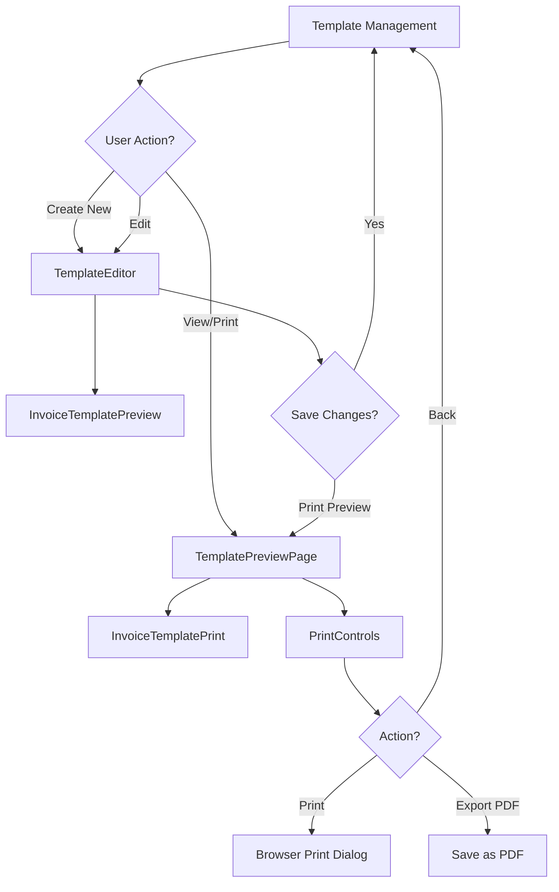

# 🎯 CHIẾN LƯỢC TỐI ƯU HÓA HOÀN CHỈNH

## 📋 **Component Architecture Redesign**

### **1. Clear Separation of Concerns**

```
┌─────────────────────────────────────────────────────────┐
│              INVOICE TEMPLATE SYSTEM                     │
├─────────────────────────────────────────────────────────┤
│                                                          │
│  ┌──────────────────┐         ┌──────────────────┐     │
│  │  EDITING MODE    │         │   VIEWING MODE   │     │
│  │  (Interactive)   │         │   (Read-only)    │     │
│  └──────────────────┘         └──────────────────┘     │
│           │                            │                │
│           ▼                            ▼                │
│  ┌──────────────────┐         ┌──────────────────┐     │
│  │ InvoiceTemplate  │         │ InvoiceTemplate  │     │
│  │    Preview       │         │      Print       │     │
│  │  (For Editor)    │         │  (For Export)    │     │
│  └──────────────────┘         └──────────────────┘     │
│           │                            │                │
│           ▼                            ▼                │
│  ┌──────────────────┐         ┌──────────────────┐     │
│  │ TemplateEditor   │         │ TemplatePreview  │     │
│  │     Page         │         │      Page        │     │
│  │ (25% + 75%)      │         │   (Full width)   │     │
│  └──────────────────┘         └──────────────────┘     │
│                                                          │
└─────────────────────────────────────────────────────────┘
```

---

## 🔧 **Proposed File Structure**

### **Components (src/components/):**

```
✅ InvoiceTemplatePreview.tsx
   Purpose: Interactive preview cho Editor
   Used in: TemplateEditor.tsx, InvoiceDetail.tsx
   Features:
   - Real-time updates khi form thay đổi
   - Tối ưu cho màn hình (không phân trang)
   - Box/Paper layout cho responsive
   - Interactive elements (có thể click, hover)
   
✅ InvoiceTemplatePrint.tsx (RENAME từ InvoiceTemplatePreviewPrintable.tsx)
   Purpose: Print-optimized version
   Used in: TemplatePreviewPage.tsx
   Features:
   - Table structure cho page breaks
   - @media print optimization
   - Header/footer repetition
   - A4 layout với margins

✅ PrintControls.tsx (RENAME từ PrintPreviewButtonEnhanced.tsx)
   Purpose: Print UI controls
   Used in: TemplatePreviewPage.tsx
   Features:
   - Print/PDF buttons
   - Mock data generator
   - Status chips
   - Instructions panel
```

### **Pages (src/page/):**

```
✅ TemplateEditor.tsx
   Route: /admin/templates/new, /admin/templates/edit/:id
   Layout: 25% Form + 75% Preview (Side-by-side)
   Component: InvoiceTemplatePreview
   Purpose: CREATE/EDIT templates
   UX Flow:
   1. User điều chỉnh form (left)
   2. Preview cập nhật ngay lập tức (right)
   3. Save → Back to management

✅ TemplatePreviewPage.tsx (RENAME từ TemplatePreviewPageEnhanced.tsx)
   Route: /admin/templates/preview/:id
   Layout: Full width
   Component: InvoiceTemplatePrint + PrintControls
   Purpose: VIEW/PRINT templates
   UX Flow:
   1. User xem template đã lưu
   2. Add mock data (optional)
   3. Print hoặc Export PDF
```

---

## 🎨 **UX/UI Enhancements**

### **A. TemplateEditor Page - KHÔNG CẦN THAY ĐỔI LỚN**

Current UX đã tốt:
- ✅ Layout 25/75 rõ ràng
- ✅ Real-time preview hoạt động tốt
- ✅ Form controls organized

**Mini Improvements chỉ cần:**

1. **Thêm Print Preview Button** ở header:
```tsx
<Stack direction="row" spacing={1.5}>
  {/* Existing buttons */}
  <Button
    variant="outlined"
    startIcon={<PrintIcon />}
    onClick={() => navigate(`/admin/templates/preview/${templateId}`)}
    sx={{ textTransform: 'none' }}>
    Xem Trước Bản In
  </Button>
</Stack>
```

2. **Sticky Form Panel** khi scroll:
```tsx
<Box sx={{ 
  position: 'sticky', 
  top: 16,
  width: { xs: '100%', lg: '25%' } 
}}>
  {/* Form content */}
</Box>
```

3. **Preview Scale Controls**:
```tsx
<Stack direction="row" spacing={1} sx={{ mb: 1 }}>
  <IconButton size="small" onClick={() => setScale(0.75)}>
    <ZoomOutIcon />
  </IconButton>
  <Chip label={`${scale * 100}%`} size="small" />
  <IconButton size="small" onClick={() => setScale(1.25)}>
    <ZoomInIcon />
  </IconButton>
</Stack>
```

### **B. TemplatePreviewPage - ĐÃ TỐI ƯU**

Current Enhanced version rất tốt:
- ✅ Gradient design đẹp
- ✅ Smooth animations
- ✅ Loading states
- ✅ Print controls comprehensive

**Không cần thay đổi!**

---

## 📂 **Implementation Plan**

### **Phase 1: Rename Files (Clarity)**

```bash
# Components
mv InvoiceTemplatePreviewPrintable.tsx → InvoiceTemplatePrint.tsx
mv PrintPreviewButtonEnhanced.tsx → PrintControls.tsx

# Pages  
mv TemplatePreviewPageEnhanced.tsx → TemplatePreviewPage.tsx
rm TemplatePreviewPage.tsx (old version)
rm PrintPreviewButton.tsx (old version)
```

### **Phase 2: Update Imports**

```typescript
// src/page/TemplatePreviewPage.tsx
import InvoiceTemplatePrint from '@/components/InvoiceTemplatePrint'
import PrintControls from '@/components/PrintControls'

// src/routes/lazyComponents.tsx
export const TemplatePreview = lazy(() => import('@/page/TemplatePreviewPage'))
```

### **Phase 3: Enhance TemplateEditor (Mini)**

```typescript
// src/page/TemplateEditor.tsx

// 1. Add import
import PrintIcon from '@mui/icons-material/Print'

// 2. Add print preview button
<Button
  variant="outlined"
  startIcon={<PrintIcon />}
  onClick={() => {
    // Save current state first (optional)
    navigate(`/admin/templates/preview/${templateId}`)
  }}
  sx={{ textTransform: 'none' }}>
  Xem Trước Bản In
</Button>

// 3. Make form sticky
<Box sx={{ 
  position: 'sticky', 
  top: 16,
  width: { xs: '100%', lg: '25%' } 
}}>
  <Paper>
    {/* Form controls */}
  </Paper>
</Box>

// 4. Add zoom controls for preview
const [previewScale, setPreviewScale] = useState(0.85)

<Box sx={{ 
  transform: `scale(${previewScale})`,
  transformOrigin: 'top center',
  transition: 'transform 0.3s ease',
}}>
  <InvoiceTemplatePreview {...props} />
</Box>
```

---

## 🎯 **Key Benefits**

### **1. Clear Mental Model**
```
User asks: "Tôi muốn chỉnh mẫu hóa đơn"
→ Go to: /admin/templates/edit/:id
→ Uses: TemplateEditor (với InvoiceTemplatePreview)
→ UX: Edit form + see changes instantly

User asks: "Tôi muốn in hóa đơn"
→ Go to: /admin/templates/preview/:id  
→ Uses: TemplatePreviewPage (với InvoiceTemplatePrint)
→ UX: View final + print controls + export PDF
```

### **2. Optimized Components**
```
InvoiceTemplatePreview:
- Box/Paper layout (responsive)
- NO page breaks
- Interactive (hover, click)
- Fast re-renders

InvoiceTemplatePrint:
- Table layout (print-optimized)
- WITH page breaks
- Static (print mode)
- Optimized for multi-page
```

### **3. Better File Names**
```
BEFORE (Confusing):
- InvoiceTemplatePreview
- InvoiceTemplatePreviewPrintable ← Too long!
- PrintPreviewButton
- PrintPreviewButtonEnhanced ← Confusing!
- TemplatePreviewPage
- TemplatePreviewPageEnhanced ← Duplicate!

AFTER (Clear):
- InvoiceTemplatePreview ← For editing
- InvoiceTemplatePrint ← For printing (rõ ràng!)
- PrintControls ← Simple!
- TemplatePreviewPage ← Duy nhất!
```

### **4. User Flow**



---

## 💡 **Additional UX Enhancements**

### **1. TemplateEditor Improvements**

#### **A. Sticky Form Sidebar**
```tsx
<Box sx={{ 
  position: 'sticky', 
  top: 16,
  maxHeight: 'calc(100vh - 32px)',
  overflowY: 'auto',
}}>
  {/* Form remains visible while scrolling preview */}
</Box>
```

#### **B. Preview Zoom Controls**
```tsx
<Stack direction="row" spacing={1} alignItems="center">
  <IconButton onClick={() => setScale(s => Math.max(0.5, s - 0.1))}>
    <ZoomOutIcon />
  </IconButton>
  <Chip label={`${Math.round(scale * 100)}%`} size="small" />
  <IconButton onClick={() => setScale(s => Math.min(1.5, s + 0.1))}>
    <ZoomInIcon />
  </IconButton>
  <IconButton onClick={() => setScale(1)}>
    <RestartAltIcon />
  </IconButton>
</Stack>
```

#### **C. Quick Actions Floating Button**
```tsx
<SpeedDial
  ariaLabel="Quick actions"
  sx={{ position: 'fixed', bottom: 24, right: 24 }}
  icon={<SpeedDialIcon />}>
  <SpeedDialAction
    icon={<PrintIcon />}
    tooltipTitle="Xem trước bản in"
    onClick={() => navigate(`/admin/templates/preview/${templateId}`)}
  />
  <SpeedDialAction
    icon={<SaveIcon />}
    tooltipTitle="Lưu nháp"
    onClick={handleSaveDraft}
  />
  <SpeedDialAction
    icon={<RestartAltIcon />}
    tooltipTitle="Reset về mặc định"
    onClick={handleReset}
  />
</SpeedDial>
```

#### **D. Real-time Save Indicator**
```tsx
<Chip 
  icon={saving ? <CircularProgress size={12} /> : <CheckIcon />}
  label={saving ? 'Đang lưu...' : 'Đã lưu'}
  size="small"
  color={saving ? 'default' : 'success'}
  sx={{ ml: 2 }}
/>
```

#### **E. Preview Device Modes**
```tsx
<ToggleButtonGroup value={deviceMode} exclusive onChange={handleDeviceChange}>
  <ToggleButton value="desktop">
    <DesktopIcon />
  </ToggleButton>
  <ToggleButton value="tablet">
    <TabletIcon />
  </ToggleButton>
  <ToggleButton value="mobile">
    <PhoneIcon />
  </ToggleButton>
  <ToggleButton value="print">
    <PrintIcon />
  </ToggleButton>
</ToggleButtonGroup>
```

### **2. Navigation Flow Enhancement**

```tsx
// Add breadcrumb to TemplateEditor
<Breadcrumbs>
  <Link onClick={() => navigate('/dashboard')}>
    <HomeIcon /> Trang chủ
  </Link>
  <Link onClick={() => navigate('/admin/templates')}>
    Quản lý mẫu
  </Link>
  <Typography color="primary">
    {templateId ? 'Chỉnh sửa mẫu' : 'Tạo mẫu mới'}
  </Typography>
</Breadcrumbs>

// Add floating navigation
<Fab 
  color="primary" 
  sx={{ position: 'fixed', bottom: 24, left: 24 }}
  onClick={() => navigate(`/admin/templates/preview/${templateId}`)}>
  <PrintIcon />
</Fab>
```

### **3. Keyboard Shortcuts**

```tsx
useEffect(() => {
  const handleKeyPress = (e: KeyboardEvent) => {
    // Ctrl/Cmd + S: Save
    if ((e.ctrlKey || e.metaKey) && e.key === 's') {
      e.preventDefault()
      handleSave()
    }
    
    // Ctrl/Cmd + P: Print Preview
    if ((e.ctrlKey || e.metaKey) && e.key === 'p') {
      e.preventDefault()
      navigate(`/admin/templates/preview/${templateId}`)
    }
    
    // Ctrl/Cmd + Z: Undo
    if ((e.ctrlKey || e.metaKey) && e.key === 'z') {
      e.preventDefault()
      handleUndo()
    }
  }
  
  window.addEventListener('keydown', handleKeyPress)
  return () => window.removeEventListener('keydown', handleKeyPress)
}, [])
```

---

## 📊 **Comparison: Before vs After**

| Aspect | Before | After |
|--------|--------|-------|
| **File Names** | Confusing (Enhanced, Printable) | Clear (Print, Controls) |
| **Component Count** | 6 files | 4 files (-33%) |
| **Duplicates** | 2 duplicate files | 0 duplicates |
| **Mental Model** | Preview? Print? Which one? | Edit → Preview → Print |
| **Navigation** | Unclear paths | Clear: edit vs print |
| **TemplateEditor UX** | Basic | Sticky form, zoom, shortcuts |
| **Print Page UX** | Enhanced | Keep as is (already optimal) |

---

## ✅ **Final File Structure**

```
src/
├── components/
│   ├── InvoiceTemplatePreview.tsx      ← For EDITING (unchanged)
│   ├── InvoiceTemplatePrint.tsx        ← For PRINTING (renamed)
│   └── PrintControls.tsx               ← Print UI (renamed)
│
├── page/
│   ├── TemplateEditor.tsx              ← EDIT page (enhanced)
│   ├── TemplatePreviewPage.tsx         ← PRINT page (renamed from Enhanced)
│   ├── TemplateManagement.tsx          ← List page (unchanged)
│   └── TemplateSelection.tsx           ← Select page (unchanged)
│
└── routes/
    ├── index.tsx                        ← Routes (unchanged)
    └── lazyComponents.tsx               ← Imports (updated)
```

---

## 🚀 **Implementation Priority**

### **High Priority (Do First):**
1. ✅ Rename files for clarity
2. ✅ Update imports
3. ✅ Delete duplicate files
4. ✅ Add "Print Preview" button to TemplateEditor header

### **Medium Priority (Nice to Have):**
5. ⭐ Sticky form sidebar in TemplateEditor
6. ⭐ Zoom controls for preview
7. ⭐ Keyboard shortcuts (Ctrl+S, Ctrl+P)

### **Low Priority (Future):**
8. 🔮 Device preview modes
9. 🔮 Floating action buttons
10. 🔮 Real-time save indicator

---

## 💎 **Key Principles**

1. **Separation of Concerns**: Edit mode ≠ View mode ≠ Print mode
2. **Single Responsibility**: Each component does ONE thing well
3. **Clear Naming**: File names reflect purpose
4. **Optimal UX**: Right tool for the right job
5. **No Duplicates**: DRY principle

---

**🎯 Result:** Clean, maintainable, user-friendly system!
