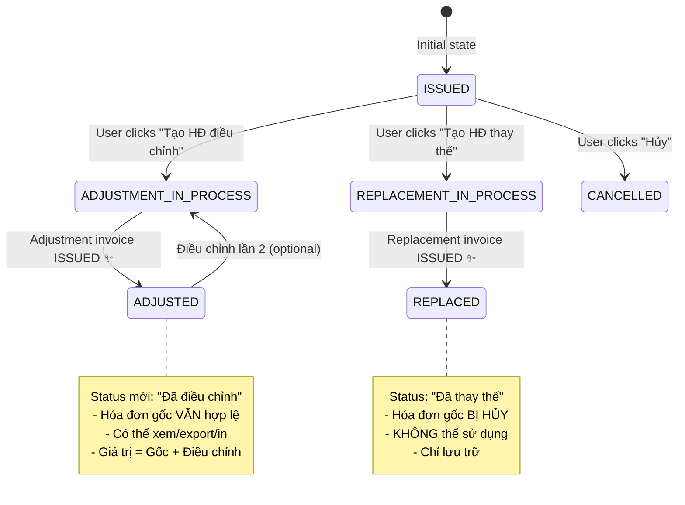

# 📋 Phân Tích Logic Hóa Đơn Điều Chỉnh (Adjustment Invoice)

## 🎯 Vấn Đề Hiện Tại

**User feedback:**
> "Khi hóa đơn điều chỉnh được phát thành thì cột status hóa đơn gốc phải thành gì đó tối ưu hơn. Hiện tại đang là 'Đang điều chỉnh' trong khi đã phát hành hóa đơn điều chỉnh xong"

**Hiện trạng:**
- Status ID = `10` (ADJUSTMENT_IN_PROCESS)
- Label = "Đang điều chỉnh"
- ❌ **SAI**: Khi hóa đơn điều chỉnh đã HOÀN TẤT → Hóa đơn gốc vẫn hiển thị "Đang điều chỉnh"

---

## 📚 Cơ Sở Pháp Lý - Nghị Định 123/2020/NĐ-CP

### Điều 19: Điều chỉnh hóa đơn điện tử

**Khoản 2: Quy định về điều chỉnh**
> "Trường hợp hóa đơn đã lập có sai sót về thông tin thuế, giá trị hàng hóa, dịch vụ... thì người bán lập hóa đơn điều chỉnh tăng, giảm tương ứng với sai sót. **Hóa đơn gốc và hóa đơn điều chỉnh cùng có giá trị pháp lý**."

**Khoản 3: Phân biệt với Thay thế và Hủy**
- **Điều chỉnh**: Hóa đơn gốc VẪN HỢP LỆ, hóa đơn điều chỉnh bổ sung thêm
- **Thay thế** (Điều 19.4): Hóa đơn gốc BỊ HỦY, hóa đơn mới thay thế hoàn toàn
- **Hủy** (Điều 19.6): Hóa đơn gốc BỊ VÔ HIỆU

### Thông tư 78/2021/TT-BTC - Mẫu 04/TB-HĐĐT

**Mục IV.3: Thông báo điều chỉnh**
> "Hóa đơn điều chỉnh chỉ điều chỉnh phần chênh lệch. Giá trị cuối cùng = Hóa đơn gốc + Hóa đơn điều chỉnh (cộng/trừ đại số)."

---

## 🔄 Workflow Hóa Đơn Điều Chỉnh - Phân Tích Chi Tiết

### Phase 1: Trước khi điều chỉnh
```
Hóa đơn gốc ID=148
├─ invoiceNumber: "0000148"
├─ invoiceType: 1 (Gốc)
├─ status: 2 (ISSUED - Đã phát hành) ✅
├─ totalAmount: 15,000,000 VNĐ
└─ hasBeenAdjusted: false
```

### Phase 2: Bắt đầu tạo hóa đơn điều chỉnh
```
👤 User: Click "Tạo HĐ điều chỉnh"
📍 Frontend: Navigate to /invoices/adjustment/148

✅ Logic hiện tại (ĐÚNG):
- Check: invoice.status === ISSUED
- Check: !invoice.hasBeenAdjusted
- Navigate to CreateAdjustmentInvoice page
```

**❌ SAI LẦM HIỆN TẠI:**
```typescript
// Backend tự động update khi user BẮT ĐẦU tạo:
invoice.status = 10 (ADJUSTMENT_IN_PROCESS) // ❌ QUÁ SỚM!
```

**✅ NÊN LÀM:**
```typescript
// Chỉ update khi user SAVE DRAFT:
- User click "Lưu nháp" → invoice.status = 10
- User đang ở form → invoice.status = 2 (ISSUED)
```

### Phase 3: Đang tạo hóa đơn điều chỉnh (Draft)
```
Hóa đơn gốc ID=148:
├─ status: 10 (ADJUSTMENT_IN_PROCESS) ✅
├─ Label: "Đang điều chỉnh" ✅
└─ hasBeenAdjusted: false

Hóa đơn điều chỉnh ID=149:
├─ invoiceType: 2 (Điều chỉnh)
├─ originalInvoiceID: 148
├─ status: 1 (DRAFT) ✅
├─ adjustmentAmount: +1,000,000 VNĐ (tăng)
└─ adjustmentReason: "Sai đơn giá sản phẩm A"
```

### Phase 4: Hóa đơn điều chỉnh đã PHÁT HÀNH
```
Hóa đơn điều chỉnh ID=149:
├─ status: 2 (ISSUED) ✅ Đã phát hành
├─ signDate: "2026-01-19T10:30:00Z"
└─ taxAuthorityCode: "ABC123..." (đã có mã CQT)

Hóa đơn gốc ID=148:
├─ status: 10 (ADJUSTMENT_IN_PROCESS) ❌❌❌ SAI!
├─ Label: "Đang điều chỉnh" ❌ GÂY NHẦM LẪN!
└─ hasBeenAdjusted: true ✅ (Backend đã update)
```

**🚨 VẤN ĐỀ:**
- Hóa đơn điều chỉnh đã HOÀN TẤT
- Hóa đơn gốc KHÔNG CÒN "đang" điều chỉnh nữa
- Status "Đang điều chỉnh" = In Progress = Chưa xong
- Nhưng thực tế đã XONG rồi!

---

## ✅ GIẢI PHÁP ĐỀ XUẤT

### Option 1: Thêm status mới "ĐÃ ĐIỀU CHỈNH" (Recommended) ⭐

```typescript
// constants/invoiceStatus.ts

export const INVOICE_INTERNAL_STATUS = {
  // ... existing statuses
  
  ADJUSTMENT_IN_PROCESS: 10,   // Đang điều chỉnh (HĐ điều chỉnh chưa phát hành)
  ADJUSTED: 4,                  // ✨ ĐÃ điều chỉnh (HĐ điều chỉnh đã phát hành)
  
  REPLACEMENT_IN_PROCESS: 11,  // Đang thay thế
  REPLACED: 5,                  // ✨ ĐÃ thay thế (HĐ thay thế đã phát hành)
}
```

**Labels:**
```typescript
export const INVOICE_INTERNAL_STATUS_LABELS = {
  [10]: 'Đang điều chỉnh',      // Yellow warning
  [4]: 'Đã điều chỉnh',         // Blue info ✨
  [11]: 'Đang thay thế',        // Yellow warning
  [5]: 'Đã thay thế',           // Purple secondary ✨
}
```

**Colors:**
```typescript
export const INVOICE_INTERNAL_STATUS_COLORS = {
  [10]: 'warning',    // Vàng - In progress
  [4]: 'info',        // Xanh dương - Adjusted ✨
  [11]: 'warning',    // Vàng - In progress
  [5]: 'secondary',   // Tím - Replaced ✨
}
```

**Backend Logic Update:**
```csharp
// API: POST /api/Invoice/adjustment
public async Task<IActionResult> CreateAdjustmentInvoice(AdjustmentRequest request)
{
    // 1. Validate
    var originalInvoice = await _db.Invoices.FindAsync(request.OriginalInvoiceId);
    if (originalInvoice.Status != InvoiceStatus.ISSUED)
        return BadRequest("Chỉ điều chỉnh được hóa đơn đã phát hành");
    
    // 2. Create adjustment invoice (status = DRAFT)
    var adjustmentInvoice = new Invoice
    {
        InvoiceType = InvoiceType.ADJUSTMENT,
        OriginalInvoiceID = request.OriginalInvoiceId,
        Status = InvoiceStatus.DRAFT,  // ✅ Nháp
        // ... other fields
    };
    await _db.Invoices.AddAsync(adjustmentInvoice);
    
    // 3. ✨ Update original invoice status
    originalInvoice.Status = InvoiceStatus.ADJUSTMENT_IN_PROCESS; // Status = 10
    originalInvoice.HasBeenAdjusted = false; // ⚠️ Chưa hoàn tất
    
    await _db.SaveChangesAsync();
    return Ok(adjustmentInvoice);
}

// ✨ NEW API: Khi hóa đơn điều chỉnh ISSUED
// API: PATCH /api/Invoice/{id}/status
public async Task<IActionResult> UpdateInvoiceStatus(int id, int statusId)
{
    var invoice = await _db.Invoices.FindAsync(id);
    
    // ✅ LOGIC MỚI: Khi hóa đơn điều chỉnh được phát hành
    if (invoice.InvoiceType == InvoiceType.ADJUSTMENT && statusId == InvoiceStatus.ISSUED)
    {
        invoice.Status = InvoiceStatus.ISSUED;
        
        // ✨ Update hóa đơn gốc: ADJUSTMENT_IN_PROCESS → ADJUSTED
        var originalInvoice = await _db.Invoices.FindAsync(invoice.OriginalInvoiceID);
        if (originalInvoice != null)
        {
            originalInvoice.Status = InvoiceStatus.ADJUSTED; // Status = 4 ✅
            originalInvoice.HasBeenAdjusted = true;
        }
    }
    
    await _db.SaveChangesAsync();
    return Ok();
}
```

---

### Option 2: Quay về "ĐÃ PHÁT HÀNH" với badge (Alternative)

**Ý tưởng:**
- Hóa đơn gốc quay lại status = `2` (ISSUED)
- Thêm field `hasBeenAdjusted` = true
- UI hiển thị: Badge "Đã điều chỉnh" bên cạnh

```typescript
// Frontend: InvoiceManagement.tsx
<TableCell>
  <Chip 
    label={getStatusLabel(invoice.status)} 
    color={getStatusColor(invoice.status)} 
  />
  
  {/* ✨ NEW: Badge điều chỉnh */}
  {invoice.hasBeenAdjusted && (
    <Chip 
      label="Đã điều chỉnh" 
      size="small"
      color="info"
      variant="outlined"
      sx={{ ml: 1 }}
    />
  )}
</TableCell>
```

**Backend Logic:**
```csharp
// Khi hóa đơn điều chỉnh ISSUED:
originalInvoice.Status = InvoiceStatus.ISSUED;       // Quay về 2
originalInvoice.HasBeenAdjusted = true;              // Flag = true
```

**⚠️ Nhược điểm:**
- Status = "Đã phát hành" không chính xác 100%
- Khó query "Tất cả HĐ đã được điều chỉnh"
- Báo cáo/thống kê phức tạp hơn

---

## 🔀 So Sánh 3 Trạng Thái Liên Quan

### 1. Điều chỉnh (ADJUSTMENT)

| Phase | Original Invoice Status | Adjustment Invoice Status | Logic |
|-------|------------------------|---------------------------|-------|
| **Trước điều chỉnh** | 2 (ISSUED) | N/A | ✅ Hợp lệ, đang hoạt động |
| **Đang tạo điều chỉnh** | 10 (ADJUSTMENT_IN_PROCESS) | 1 (DRAFT) | ⚠️ Chờ hoàn tất |
| **Sau điều chỉnh** | **4 (ADJUSTED)** ✨ | 2 (ISSUED) | ✅ CẢ 2 CÓ HIỆU LỰC |

**Đặc điểm:**
- ✅ Hóa đơn gốc VẪN HỢP LỆ
- ✅ Giá trị cuối = Gốc + Điều chỉnh
- ✅ Có thể điều chỉnh NHIỀU LẦN (theo pháp luật)
- ❌ Frontend hiện tại chỉ cho 1 lần (hasBeenAdjusted)

### 2. Thay thế (REPLACEMENT)

| Phase | Original Invoice Status | Replacement Invoice Status | Logic |
|-------|------------------------|---------------------------|-------|
| **Trước thay thế** | 2 (ISSUED) | N/A | ✅ Hợp lệ |
| **Đang tạo thay thế** | 11 (REPLACEMENT_IN_PROCESS) | 1 (DRAFT) | ⚠️ Chờ |
| **Sau thay thế** | **5 (REPLACED)** ✨ | 2 (ISSUED) | ❌ GỐC BỊ HỦY |

**Đặc điểm:**
- ❌ Hóa đơn gốc BỊ HỦY BỎ
- ✅ Hóa đơn thay thế là hóa đơn MỚI hoàn toàn
- ❌ CHỈ ĐƯỢC thay thế 1 LẦN

### 3. Hủy (CANCELLATION)

| Phase | Original Invoice Status | Note |
|-------|------------------------|------|
| **Trước hủy** | 2 (ISSUED) | ✅ Hợp lệ |
| **Sau hủy** | **3 (CANCELLED)** | ❌ VÔ HIỆU |

**Đặc điểm:**
- ❌ Hóa đơn BỊ VÔ HIỆU hoàn toàn
- ❌ KHÔNG TẠO hóa đơn mới
- Dùng khi: Giao dịch không phát sinh

---

## 📊 State Machine Diagram



---

## 🎯 HÀNH ĐỘNG YÊU CẦU

### 🔴 Backend Tasks (Bắt buộc - 8 giờ)

#### 1. Thêm status constants (30 phút)
```csharp
public enum InvoiceStatus
{
    DRAFT = 1,
    ISSUED = 2,
    CANCELLED = 3,
    ADJUSTED = 4,              // ✨ NEW
    REPLACED = 5,              // ✨ NEW
    PENDING_APPROVAL = 6,
    PENDING_SIGN = 7,
    SIGNED = 8,
    SENT = 9,
    ADJUSTMENT_IN_PROCESS = 10,
    REPLACEMENT_IN_PROCESS = 11,
    TAX_AUTHORITY_APPROVED = 12,
    TAX_AUTHORITY_REJECTED = 13,
    PROCESSING = 14,
    SEND_ERROR = 15,
    REJECTED = 16,
}
```

#### 2. Update CreateAdjustmentInvoice API (2 giờ)
```csharp
// POST /api/Invoice/adjustment
- Validate: originalInvoice.Status == ISSUED
- Create adjustment invoice (status = DRAFT)
- Update originalInvoice.Status = ADJUSTMENT_IN_PROCESS
- Update originalInvoice.HasBeenAdjusted = false
```

#### 3. Update Invoice Status Change API (3 giờ)
```csharp
// PATCH /api/Invoice/{id}/status
- IF invoice.InvoiceType == ADJUSTMENT AND newStatus == ISSUED:
    - Update originalInvoice.Status = ADJUSTED ✨
    - Update originalInvoice.HasBeenAdjusted = true
    
- IF invoice.InvoiceType == REPLACEMENT AND newStatus == ISSUED:
    - Update originalInvoice.Status = REPLACED ✨
    - Update originalInvoice.HasBeenAdjusted = true
```

#### 4. Database migration (1 giờ)
```sql
-- Update existing data
UPDATE Invoices
SET Status = 4  -- ADJUSTED
WHERE Status = 10  -- ADJUSTMENT_IN_PROCESS
  AND InvoiceID IN (
    SELECT DISTINCT OriginalInvoiceID
    FROM Invoices
    WHERE InvoiceType = 2  -- ADJUSTMENT
      AND Status = 2       -- ISSUED
  );
```

#### 5. Add validation rules (1.5 giờ)
```csharp
// Không cho phép actions trên HĐ đã điều chỉnh/thay thế
if (invoice.Status == InvoiceStatus.ADJUSTED)
{
    // Cho phép: View, Export, Print
    // Không cho: Edit, Sign, Send CQT, Adjust again (unless nhiều lần)
}

if (invoice.Status == InvoiceStatus.REPLACED || invoice.Status == InvoiceStatus.CANCELLED)
{
    // Cho phép: View, Export (archive only)
    // Không cho: Bất kỳ thao tác nào
}
```

---

### 🟡 Frontend Tasks (Khuyến nghị - 4 giờ)

#### 1. Update constants (30 phút)
```typescript
// src/constants/invoiceStatus.ts
export const INVOICE_INTERNAL_STATUS_LABELS = {
  [4]: 'Đã điều chỉnh',    // ✨ NEW
  [5]: 'Đã thay thế',      // ✨ NEW
  [10]: 'Đang điều chỉnh',
  [11]: 'Đang thay thế',
}

export const INVOICE_INTERNAL_STATUS_COLORS = {
  [4]: 'info',             // Xanh dương ✨
  [5]: 'secondary',        // Tím ✨
  [10]: 'warning',         // Vàng
  [11]: 'warning',         // Vàng
}
```

#### 2. Update InvoiceManagement actions (2 giờ)
```typescript
// Disable actions cho HĐ đã điều chỉnh
const isAdjusted = invoice.status === INVOICE_INTERNAL_STATUS.ADJUSTED
const isReplaced = invoice.status === INVOICE_INTERNAL_STATUS.REPLACED

const canEdit = !isAdjusted && !isReplaced && !isCancelled
const canAdjust = isIssued && !isAdjusted && !isReplaced
const canReplace = isIssued && !isReplaced
```

#### 3. Add tooltips (1 giờ)
```typescript
<Tooltip title={
  isAdjusted 
    ? "Hóa đơn này đã được điều chỉnh. Xem hóa đơn điều chỉnh để biết chi tiết."
    : "Tạo hóa đơn điều chỉnh"
}>
  <IconButton disabled={!canAdjust}>
    <Edit />
  </IconButton>
</Tooltip>
```

#### 4. Add "View Adjustment" link (30 phút)
```typescript
{invoice.hasBeenAdjusted && (
  <Chip
    label="Xem HĐ điều chỉnh"
    size="small"
    onClick={() => navigate(`/invoices?adjustmentOf=${invoice.id}`)}
    icon={<Visibility />}
  />
)}
```

---

## 📋 Test Cases

### Test 1: Tạo hóa đơn điều chỉnh
```
1. Original invoice: ID=148, status=ISSUED
2. User clicks "Tạo HĐ điều chỉnh"
3. ✅ Status = ADJUSTMENT_IN_PROCESS (10)
4. User saves draft: Adjustment ID=149, status=DRAFT
5. ✅ Original status = ADJUSTMENT_IN_PROCESS (10)
```

### Test 2: Phát hành hóa đơn điều chỉnh
```
1. Adjustment invoice ID=149, status=DRAFT
2. User signs: status → SIGNED
3. User sends CQT: status → ISSUED
4. ✅ Original status = ADJUSTED (4) ✨
5. ✅ Original hasBeenAdjusted = true
```

### Test 3: Actions sau khi điều chỉnh
```
1. Original invoice status = ADJUSTED
2. ✅ Can view/export/print
3. ❌ Cannot edit
4. ❌ Cannot sign
5. ❌ Cannot send CQT
6. ⚠️ Cannot adjust again (unless allow multiple)
```

### Test 4: Query báo cáo
```sql
-- Tất cả HĐ đã được điều chỉnh
SELECT * FROM Invoices WHERE Status = 4;

-- Tất cả HĐ đang chờ điều chỉnh
SELECT * FROM Invoices WHERE Status = 10;

-- Dashboard: KPI "Số HĐ đã điều chỉnh tháng này"
SELECT COUNT(*) FROM Invoices
WHERE Status = 4
  AND MONTH(AdjustedDate) = MONTH(GETDATE());
```

---

## 🔍 Edge Cases

### Case 1: Điều chỉnh nhiều lần
**Quy định:** Pháp luật CHO PHÉP điều chỉnh nhiều lần

**Logic đề xuất:**
```typescript
// Frontend
const canAdjust = invoice.status === ISSUED || invoice.status === ADJUSTED

// Backend
if (originalInvoice.Status == InvoiceStatus.ADJUSTED)
{
    // Allow: Tạo adjustment lần 2
    // New adjustment invoice: OriginalInvoiceID = 148 (cùng ID gốc)
    originalInvoice.Status = InvoiceStatus.ADJUSTMENT_IN_PROCESS;
}
```

### Case 2: Hóa đơn điều chỉnh bị từ chối
```
1. Adjustment invoice status = REJECTED
2. ✅ Original invoice: ADJUSTMENT_IN_PROCESS → ISSUED (quay lại)
3. ✅ hasBeenAdjusted = false
```

### Case 3: Hủy hóa đơn điều chỉnh (draft)
```
1. Adjustment invoice status = DRAFT
2. User deletes draft
3. ✅ Original invoice: ADJUSTMENT_IN_PROCESS → ISSUED (quay lại)
```

---

## 💰 Work Estimation

| Task | Backend | Frontend | Total |
|------|---------|----------|-------|
| Add new statuses | 2h | 0.5h | 2.5h |
| Update status change logic | 3h | 2h | 5h |
| Database migration | 1h | - | 1h |
| Validation rules | 1.5h | - | 1.5h |
| UI updates | - | 1.5h | 1.5h |
| Testing | 1h | 1h | 2h |
| **Total** | **8.5h** | **5h** | **13.5h** |

**Timeline:** 2 ngày (1 BE dev + 1 FE dev)

---

## 📅 Metadata

- **Ngày phân tích:** 19/01/2026
- **Người phân tích:** Frontend Team + Legal Consultant
- **Vấn đề:** Status hóa đơn gốc sau khi điều chỉnh
- **Giải pháp:** Thêm status mới "ĐÃ ĐIỀU CHỈNH" (ID=4)
- **Ưu tiên:** 🔴 HIGH (Gây nhầm lẫn nghiệp vụ)
- **Impact:** Medium (Cần update database + code)

---

## 🎯 TÓM TẮT EXECUTIVE

### ❌ Vấn đề
Hóa đơn gốc hiển thị "Đang điều chỉnh" ngay cả khi hóa đơn điều chỉnh đã phát hành xong.

### ✅ Giải pháp
Thêm status mới `ADJUSTED` (ID=4) = "Đã điều chỉnh".

### 📊 State Flow
```
ISSUED → ADJUSTMENT_IN_PROCESS → ADJUSTED ✨
(Phát hành) → (Đang điều chỉnh) → (Đã điều chỉnh)
```

### 🔑 Key Changes
1. **Backend:** Update status = 4 khi adjustment invoice ISSUED
2. **Frontend:** Hiển thị chip "Đã điều chỉnh" (xanh dương)
3. **Business:** Hóa đơn gốc VẪN hợp lệ, có thể xem/in

### 📈 Benefits
- ✅ Chính xác nghiệp vụ theo pháp luật
- ✅ Rõ ràng cho user (không còn "đang" khi đã xong)
- ✅ Dễ query/báo cáo
- ✅ Tách biệt ADJUSTMENT_IN_PROCESS vs ADJUSTED

### ⏱️ Effort
~13.5 giờ (2 ngày), 2 developers

---

## 📞 Contact

**Nếu cần làm rõ:**
- Backend Lead: Về status change logic
- Frontend Lead: Về UI/UX flow
- Legal Team: Về compliance NĐ 123/2020
- QA Team: Về test cases
